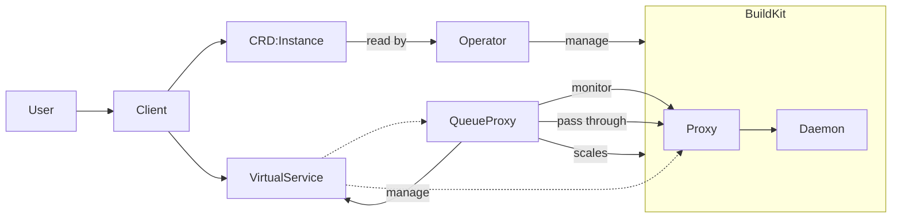

# Remote Build

An collection of utilities:

Client:
- Wrap around the docker CLI
- Deploys CRs into the cluster to represent a build instance
- passes build args through to docker CLI and sets up remote

Operator:
- Watches for CRs and deploys buildkit single-replica statefulset and proxy pods

QueueProxy:
- holds incoming build TCP connections and scales up buildkit pod when a build comes in
- passes through the TCP connection when the buildkit pod is alive
- reprograms virtualservice to forward requests directly to buildkit when running
- monitors connection metrics from proxy sidecar
- scales down the buildkit pod when there haven't been any new builds for X amount of time

