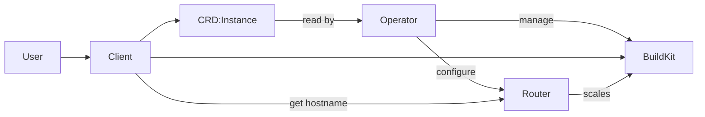

# Remote Build

An collection of utilities:

Client:
- Wrap around buildctl
- Extracts context from the build arguments and passes that to the Router
- Passes arguments straight through to buildctl and appends the remote the Router replied with
- Deploys CRs into the cluster to represent a build instance

Operator:
- Watches for CRs and deploys buildkit single-replica statefulset and proxy pods

Router:
- called by client to warm up a buildkit pod when a build comes in
- monitors connection metrics from proxy sidecar
- scales down the buildkit pod when there haven't been any new builds for X amount of time

